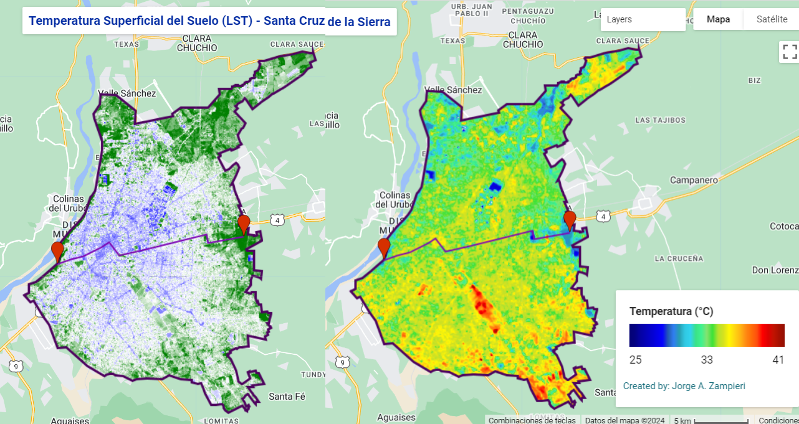

# Estimación de la LST y NDVI
Con este proyecto, se analiza el comportamiento  mediante un gráfico de serie de tiempo de la Temperatura Superficial o Land Surface Temperture (LST por sus siglas en inglés) y el Índice de Vegetación de Diferenica Normalizada (NDVI) en el área urbana de la ciudad de Santa Cruz de la Sierra - Bolivia. Para ello, se grafica una ruta (transecto) que abarca del Oeste al Este de la ciudad, pasando por sitios de interés.
### Puntos de interés
- Área Munipal Curiche La Madre
- Rotonda 4to anillo Av. Piraí
- Antiguo Mercado Abasto
- 1er anillo Av. Cañoto
- Plaza 24 de Septiembre
- Parque Urbano
- Predios de la Feria Barrio Lindo
- Laguna Guapilo
- El Jardín Botánico
### NDVI y LST

### Datos y Materiales usados
- [Imágenes Landsat 8](https://developers.google.com/earth-engine/datasets/catalog/LANDSAT_LC08_C02_T1_TOA "Imágenes Landsat 8")
- [Artículo Científico (By: Mirza Waleed)](https://waleedgeo.com/publication/waleed-leveraging-2022/ "Artículo científico (By: Mirza Waleed)")
- [Tutorial (By:  Kenneth Ekpetere)](https://www.youtube.com/watch?v=UmqaqKIQ2gk&t=985s "Tutorial (By:  Kenneth Ekpetere)")
### Resultado

